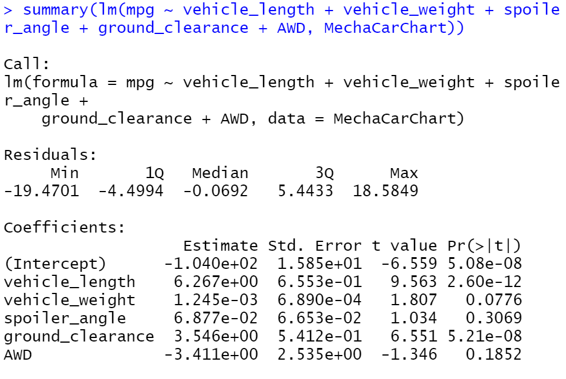
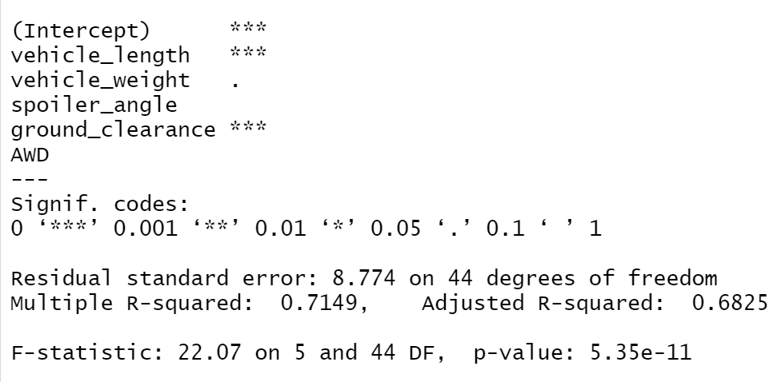
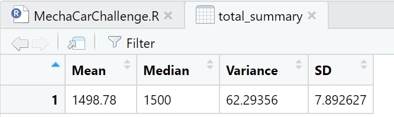
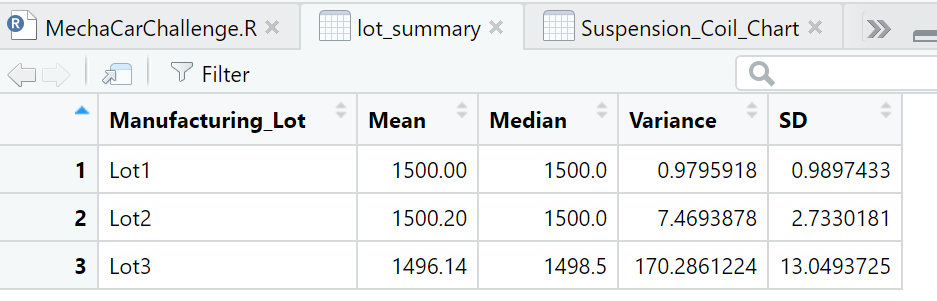
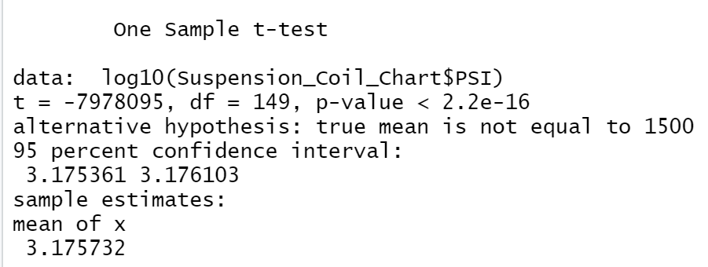
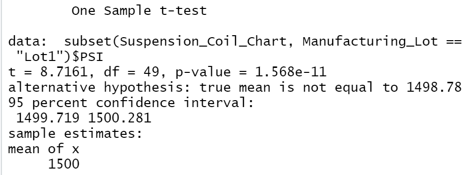
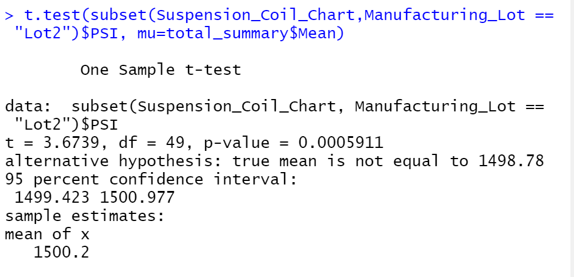
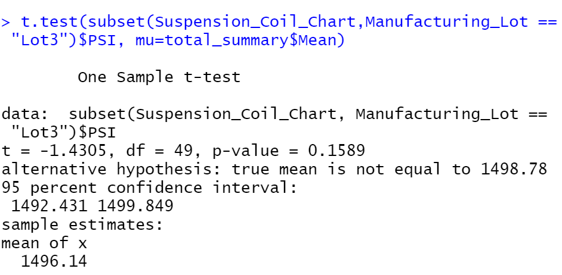

# MechaCar_Statistical_Analysis
## Linear Regression to Predict MPG
### Which variables/coefficients provided a non-random amount of variance to the mpg values in the dataset?
The Vechile Weight and All-Wheel-Drive (AWD) provided a non-random amount of variance to the mpg values in the dataset. These columns did not have a significant impact on mpg. 

### Is the slope of the linear model considered to be zero? Why or why not?
If we have our hypothesis as follows:
H0: PH = 0.5 (null hypothesis)
HA: PH ≠ 0.5 (alternate hypothesis) 
Since our p-value is 5.35e-11, we reject our null hypothesis making the slope of our linear model not zero. 

  

### Does this linear model predict mpg of MechaCar prototypes effectively? Why or why not?
This linear model does not predict mpg of MechaCar prototypes effectively.  Within this dataset there are not enough significant variables, meaning that this analysis only works on our current set of data.  Ideally we should have more significant variables, which would prove more effective when analyzing new prototypes.

## Summary Statistics on Suspension Coils
### The design specifications for the MechaCar suspension coils dictate that the variance of the suspension coils must not exceed 100 pounds per square inch. Does the current manufacturing data meet this design specification for all manufacturing lots in total and each lot individually? Why or why not? 

As show below in the total summary chart, the average of the three manufacturing lots does meet the requirements for suspension coils.  Individually only Lot 3 does not meet the requirement that the coils must not exceed 100 pounds per square inch.  Lot 1 and 2 have similar results, however Lot 3 has drastically larger numbers and changes the final outcome. 

Within the lot summary chart it is clear to see that the variance and standard deviation are significantly higher in manufacturing lot 3. 

## T-Tests on Suspension Coils

First I used a t-test to determine if the average PSI of these manufacturing lots are different from the population mean of 1,500 pounds per square inch. Since the p-value was 2.2e-16, it can be determined that the two means are statistically not similar therefore we do not have enough evidence to reject the null hypothesis. 

Using the subset function to only look at the row for Manufacturing Lot 1 to compare against the population mean of 1,500 pounds per square inch. The result was a p-value of 1.568e-11, it can be determined that the two means are statistically not similar therefore we do not have enough evidence to reject the null hypothesis. 

Using the subset function to only look at the row for Manufacturing Lot 2 to compare against the population mean of 1,500 pounds per square inch. The result was a p-value of 0.0005911, it can be determined that the two means are statistically not similar therefore we do not have enough evidence to reject the null hypothesis. 

Using the subset function to only look at the row for Manufacturing Lot 3 to compare against the population mean of 1,500 pounds per square inch. The result was a p-value of 0.1589, it can be determined that the two means are statistically not similar therefore we have enough evidence to reject the null hypothesis. 
 
